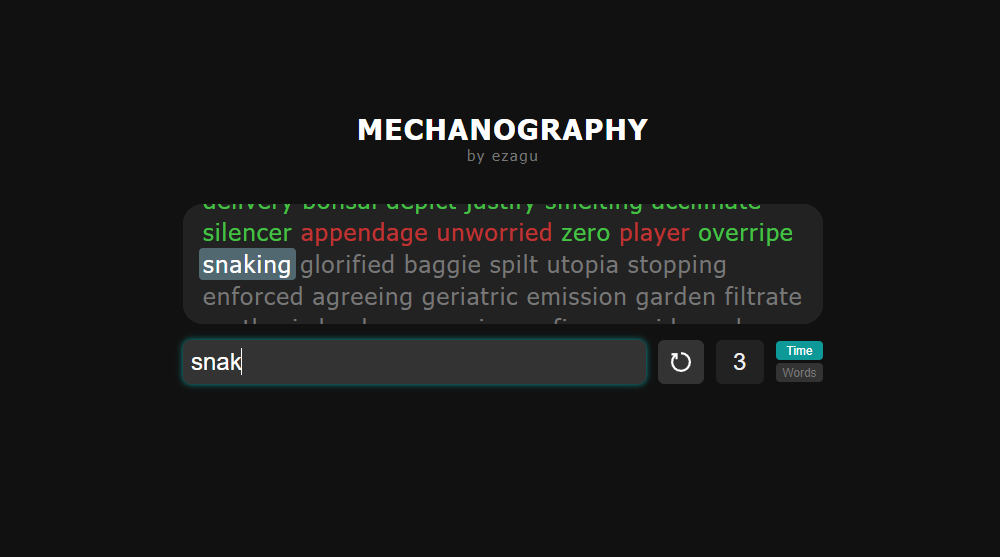
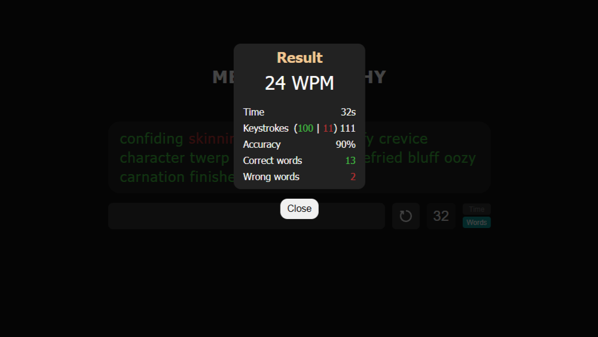

# Mechanography 🧠⌨️

Mechanography is a typing game designed to improve your speed and accuracy by challenging you to type random words as quickly as possible. The project was built using HTML, CSS, and JavaScript, and it's fully responsive — including mobile support.

You can try it live here: [mechanography.vercel.app](https://mechanography.vercel.app)

## 🚀 Features

- 🔤 Typing game with live feedback
- 📱 Mobile support (touchscreen-friendly)
- 🧠 Random word generation using an external API
- 🕹️ Two game modes: timed mode and word-count mode
- ⌛ Real-time stats: WPM (words per minute), accuracy, and more
- 🌙 Dark-mode UI with a clean and minimalist design

## 🔗 API Used

This project uses the [Random Word API](https://random-word-api.vercel.app/api) to dynamically fetch words for the typing challenge.

## 🛠️ Tech Stack

- HTML5
- CSS3
- JavaScript (Vanilla)
- Fetch API

## 📸 Screenshots

Made by [Agustín Calpe](https://www.linkedin.com/in/agustin-calpe/)